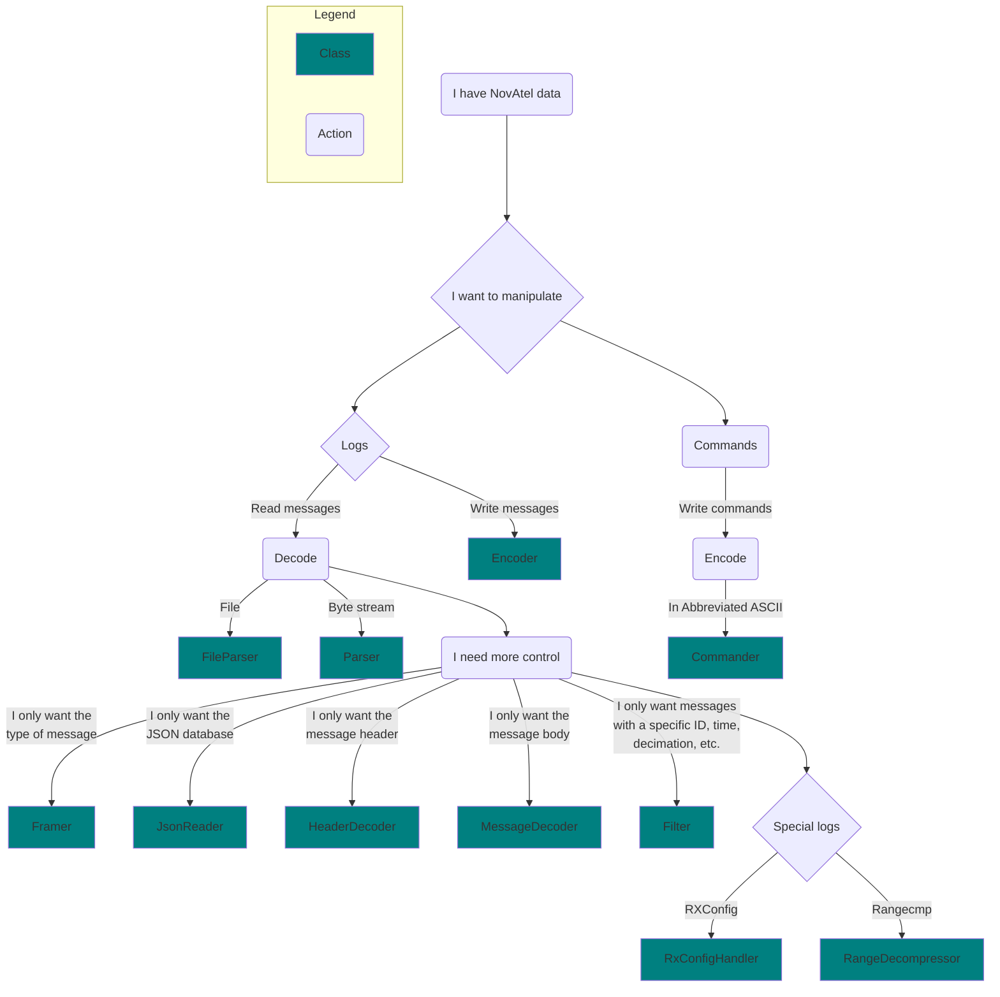

<div align="center">
    
</div>

# NovAtel EDIE

EDIE (Encode Decode Interface Engine) is a C++ SDK (Software Development Kit) that can encode and decode messages from NovAtel's [**OEM7**](https://novatel.com/products/receivers/oem-receiver-boards/oem7-receivers) receivers
from one format into another. For example, converting an ASCII log into a Binary log.

EDIE is maintained and published by [NovAtel](https://www.novatel.com).

Documentation on NovAtel's data (commands, logs, messages, and responses) can be found [here](https://docs.novatel.com/OEM7/Content/Commands/CommandsLogs.htm).

Information on the `novatel_edie` [Python package can be found here](./python/readme.md). The rest of this document pertains only to the C++ SDK.

## Table of Contents

- [Getting Started](#getting-started)
- [Usage](#usage)
- [Examples](#examples)
- [Code Style](#code-style)
- [API Stability](#api-stability)
- [Authors](#authors)
- [License](#license)

## Getting Started

EDIE can be built from source by cloning this repository `git clone https://github.com/novatel/novatel_edie.git` and following along 

### Dependencies

EDIE is C++ 17 project which uses a [CMake](https://cmake.org/) build system directly integrated with [Conan 2](https://docs.conan.io/2/index.html) for dependency management. Information is provided below on how to acquire all of the necessary build dependencies.

- C++ 17 compiler
    - Windows
        - MSVC (recommended): Download and install both the [Build Tools for Visual Studio 2026](https://visualstudio.microsoft.com/downloads/#build-tools-for-visual-studio-2026) and the [Microsoft Visual C++ v14 Redistributable](https://visualstudio.microsoft.com/downloads/#microsoft-visual-c-v14-redistributable).
        - g++: Install as part of [the MSYS2  tool collection](https://www.msys2.org/).
    - Linux 
        - Install the toolchains for g++ or clang using your distribution's package manager.
- CMake (>=3.15)
    Installers can be found on [the downloads page](https://cmake.org/download/). For Linux it is recommended to use your distribution's package manager instead.
- Conan (>=2.4.0)
    Follow the [installation instructions](https://docs.conan.io/2/installation.html) from the Conan 2 documentation.

### Building the Project

A build can be configured using cmake as follows:

```
cmake -S {path_to_edie_repository} -B {path_to_build_folder}
```

This step will automatically use conan to install all dependencies within the newly created build folder. 

The build can then be kicked off as:

```
cmake --build {path_to_build_folder}
```

### CMake Presets

It is recommended to use [CMake presets](https://cmake.org/cmake/help/latest/manual/cmake-presets.7.html) to define specific build parameters e.g. compiler and build type.
The [CMakePresets.json](./CMakePresets.json) file contains a few default options and you can extend it by creating a `CMakeUserPresets.json` file with your personal configurations. 

Take the `windows-msvc` configure preset and its corresponding `windows-msvc-debug` and `windows-msvc-release` build presets as an example. 
The configure preset can be used via `cmake --preset windows-msvc` to configure a windows MSVC build within a `out/build` folder. 
The a debug build can then be initiated via `cmake --build --preset windows-msvc-debug` or a release on via `cmake --build --preset windows-msvc-release`.

CMake presets are especially useful when initiating builds from an IDE.
Almost all IDEs have inbuilt or extension support for CMake which allow selecting between presets to configure a build.

### Conan CMake Presets

Whenever conan installs dependencies it also creates a `CMakePresets.json` file within the build folder.
To make these presets available add the following to your `CMakeUserPresets.json` file:
```
    "include": [
        "ConanPresets.json"
    ]
```

This works because the configuration in [conanfile.py](./conanfile.py) is set to place a reference presets file at this location.

This should be done when setting up a configuration directly via the `conan install` command. In most cases this approach is unnecessary, however it is the simplest way to do a cross compilation build. Otherwise you should not include these conan generated presets as they can pollute your options and lead to duplicate key errors.

## Usage

EDIE provides different classes for interfacing with messages, each at a different level of the decoder stack. The main use-case of EDIE is to transform the data
from one format into another. Documentation on the three NovAtel formats can be found here: [ASCII](https://docs.novatel.com/OEM7/Content/Messages/ASCII.htm), 
[Abbreviated ASCII](https://docs.novatel.com/OEM7/Content/Messages/Abbreviated_ASCII.htm), and [Binary](https://docs.novatel.com/OEM7/Content/Messages/Binary.htm).
Flattened binary is a format unique to EDIE that standardizes the Binary format to have consistent-length arrays. So variable-length arrays are converted into fixed-size arrays.
Flattened binary covers all formats (ASCII, abbreviated ASCII, and Binary).

| User       | Task               | Purpose                                                 | Format                  | Example                                    |
|------------|--------------------|---------------------------------------------------------|-------------------------|--------------------------------------------|
| Person     | Human-readable     | To make the data understandable to people               | ASCII/Abbreviated ASCII | Finding the timestamp of a BESTPOS message |
| Programmer | Program-accessible | To make the data accessible from a programming language | Flattened Binary        | Filtering a log file for BESTPOS messages  |
| Computer   | Machine-readable   | To have efficient transmission and storage of the data  | Binary                  | Efficient long-term storage of logs        |

### Flowchart

Use the following flowchart to determine which EDIE class you need.



### Notes

- The MessageDecoder and Encoder class output and input the EDIE intermediate format and not ASCII/Binary. 
- The [RXCONFIG](https://docs.novatel.com/OEM7/Content/Logs/RXCONFIG.htm) and [RANGECMP](https://docs.novatel.com/OEM7/Content/Logs/RANGECMP.htm)[*](https://docs.novatel.com/OEM7/Content/Logs/RANGECMP2.htm)[*](https://docs.novatel.com/OEM7/Content/Logs/RANGECMP4.htm) 
messages are handled in different classes because of their unique traits.
- The FileParser and Parser classes automatically filter and decode RXCONFIG and RANGECMP messages. So the RxConfigHandler and RangeDecompressor classes should only be used 
when bypassing the Parser class.
- The Parser class can handle any byte stream such as a file stream, serial, Ethernet, or USB.

## Examples

Examples are provided in the [examples](examples) folder.

### File Parser Format Conversion

[This example](./examples/novatel/converter_file_parser/converter_file_parser.cpp) shows how to convert a file 
from one format to another using the FileParser class.

Run the resulting executable with the following command: `converter_file_parser.exe <path_to_json_db> <input_file> <output_format>`

### Parser Format Conversion

[This example](./examples/novatel/converter_parser/converter_parser.cpp) shows how to write bytes to the internal
buffer of a Parser and have it convert those bytes to a specified format.

Run the resulting executable with the following command: `converter_parser.exe <path_to_json_db> <input_file> <output_format>`

### Piecewise Conversion

[This example](./examples/novatel/converter_components/converter_components.cpp) shows how to use the individual components of the decoder stack
in order to convert a file from one format to another.
It demonstrates how to use the JsonReader, Framer, Filter HeaderDecoder, MessageDecoder, Encoder classes to achieve 
fine-grained control over the conversion process.

Run the resulting executable with the following command: `converter_components.exe <path_to_json_db> <input_file> <output_format>`

### Adding Message Definitions

[This example](./examples/novatel/json_parser/json_parser.cpp) shows how to dynamically add message definitions to the JsonReader class.

Run the resulting executable with the following command: `converter_parser.exe <path_to_json_db> <input_file> <output_format> <msg_def_json_string>`

### Decompressing Range Logs

[This example](./examples/novatel/range_decompressor/range_decompressor.cpp) shows how to decompress range logs.
For example go from [RANGECMP4](https://docs.novatel.com/OEM7/Content/Logs/RANGECMP4.htm) to [RANGE](https://docs.novatel.com/OEM7/Content/Logs/RANGE.htm).

Run the resulting executable with the following command: `range_decompressor.exe <path_to_json_db> <input_file> <output_format>`

### Command Encoding

[This example](./examples/novatel/command_encoding/command_encoding.cpp) shows how to
use the Commander class to encode a command from 
[Abbreviated ASCII](https://docs.novatel.com/OEM7/Content/Messages/Abbreviated_ASCII.htm) to an
[ASCII](https://docs.novatel.com/OEM7/Content/Messages/ASCII.htm) or
[Binary](https://docs.novatel.com/OEM7/Content/Messages/Binary.htm) command.
Note that all fields, even optional ones, must be provided in the abbreviated ASCII string command.

Run the resulting executable with the following command: `command_encoding.exe <path_to_json_db> <output_format> <abbreviated_ascii_command>`

### Converting RXConfig Logs

[This example](./examples/novatel/rxconfig_handler/rxconfig_handler.cpp) shows how to use the RxConfigHandler class 
to convert [RXConfig](https://docs.novatel.com/OEM7/Content/Logs/RXCONFIG.htm?Highlight=RXConfig) logs to another format.
Converting RXConfig logs requires special treatment due to their outlying message protocol.

Run the resulting executable with the following command: `rxconfig_handler.exe <path_to_json_db> <input_file> <output_format>`

### Accessing Message Fields

There are two approaches to accessing a message's fields after decoding.
The following examples show how to access the "latitude" field of a BESTPOS message:

#### Approach 1: Search by Field Name

Search for the desired `FieldContainer` by name after decoding, then use `std::get<T>` to get the field's value, where `T` is the field's type.

**✅ Advantages:**
- Works with any message format (ASCII, Abbreviated ASCII, Binary, etc.)
- No code generation required
- Some measure of type safety with `std::get<T>` (you will get a `std::bad_variant_access` exception if you input the wrong type)

**⚠️ Disadvantages:**
- Computational overhead from linear search and string comparisons

**Example:**

```cpp
std::vector<FieldContainer> stMessage;
double latitude;
eDecoderStatus = clMessageDecoder.Decode(pucFrameBuffer, stMessage, stMetaData);

if (eDecoderStatus == STATUS::SUCCESS) {
    if (stMetaData.usMessageId == 42 /*BESTPOS*/) {
        for (const auto& field : stMessage) {
            if (field.fieldDef->name == "latitude") {
                latitude = std::get<double>(field.fieldValue);
            }
        }
    }
}
``````

If you prefer, `std::find_if` from the `<algorithm>` library can be used instead of the `for` loop as follows:

```cpp
if (stMetaData.usMessageId == 42/*BESTPOS*/) {
    latitude = std::get<double>(std::find_if(stMessage.begin(), stMessage.end(), [](const FieldContainer& fc) { return fc.fieldDef->name == "latitude"; })->fieldValue);
}
``````

#### Approach 2: Cast to Generated Struct

If your input data is in the flattened binary format then, after decoding a message's header, you may cast it to the appropriate struct and access its fields as member variables.
Struct definitions are generated by running

```
python scripts/gen_flat_cpp_structs.py <input_database_file>
```

This will generate a header file called `novatel_message_definitions.hpp` in your current working directory.

**✅ Advantages:**
- Direct access to fields via member variables (very fast)

**⚠️ Disadvantages:**
- Only works with the flattened binary format
- Requires running Python script to generate structs
- Uses `reinterpret_cast` (undefined behaviour if you cast to the wrong type)

**Example:**

```cpp
#include "novatel_message_definitions.hpp" // TODO: insert correct relative path here
...
IntermediateHeader stHeader;
double latitude;
eDecoderStatus = clHeaderDecoder.Decode(pucFrameBuffer, stHeader, stMetaData);

if (eDecoderStatus == STATUS::SUCCESS)
{
    // Remember to skip over the header before casting
    pucFrameBuffer += stMetaData.uiHeaderLength;

    if (stMetaData.usMessageId == 42/*BESTPOS*/) {
        auto bestposLog = reinterpret_cast<struct BESTPOS*>(pucFrameBuffer);
        latitude = bestposLog->latitude;
    }
}
``````

## Code Style

### Clang-Format

We format our C++ code using Clang-Format as it provides a well-defined set of rules and conventions that make it easier for developers to collaborate on and understand a codebase. Additionally, adhering to this styling guide helps catch potential coding errors and reduces the likelihood of introducing bugs through inconsistent formatting.

If the code in a pull request does not match the style rules defined in our .clang-format file, the pipeline will fail and you will have to correct any discrepancies.

### EditorConfig

Non-C++ files are more loosely formatted using EditorConfig. Failures in the EditorConfig pipeline stage will have more information than Clang-Format, so manual fixes are a bit easier. 

### Applying Formatting Settings

#### Windows

You can install llvm and clang-format via the [builds page](https://llvm.org/builds/). However, Visual Studio has built-in clang-format support since 2017, as described [here](https://learn.microsoft.com/en-us/visualstudio/ide/reference/options-text-editor-c-cpp-formatting?view=vs-2022).

The shortcuts below can be used to apply format settings to individual files.

- **Visual Studio**:  `Ctrl` + `K`, `Ctrl` + `D`

- **VS Code**: `Shift` + `Alt` + `F`

#### Linux

If you are using linux, you simply use the commands below to install clang-format and apply the settings. 

`sudo apt install clang-format`

`find src examples \( -name '*.cpp' -o -name '*.hpp' \) -exec clang-format -Werror --style=file -i {} +`

## Regression Testing

Regression testing is a naive form of testing in that it will fail for all functional changes, even if they are intentional. When you have intentional changes in an MR, you can simply update the files in regression/targets in your MR.

To see the regression differences, you can download the artifacts from the failed pipeline, copy the artifacts from the regression folder and diff them with the artifacts in the regression/targets folder. One way to do this is just copy-paste them in, and then look at the git diff.

## API Stability

Currently, we do not guarantee API stability as development progresses. While we intend to minimize the frequency of changes that cause old things to break, please be aware that we retain the right to add, remove, or modify components.

## Authors

- [**NovAtel**](https://www.novatel.com), part of [**Hexagon**](https://hexagon.com).

## License

This project is licensed under the MIT License - see the [LICENSE](LICENSE) file for details.
