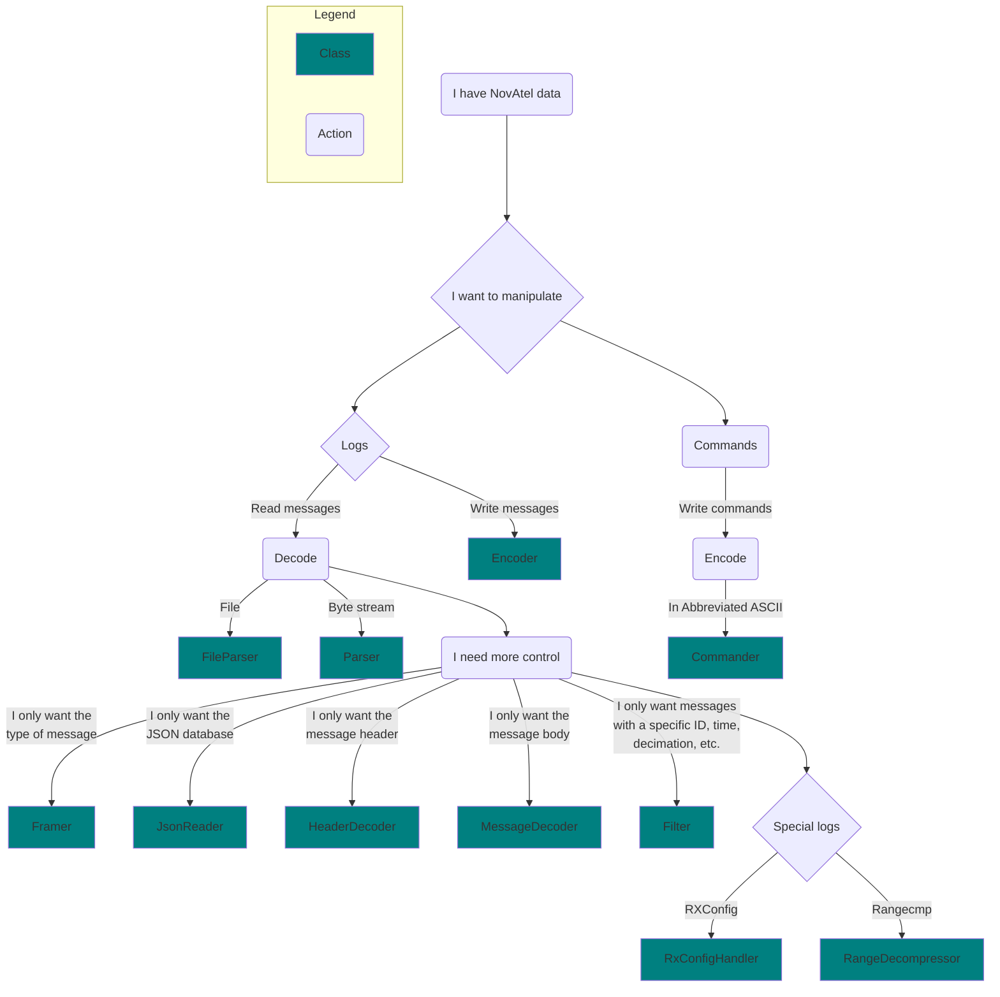

<div align="center">
    
</div>

# NovAtel EDIE

EDIE (Encode Decode Interface Engine) is a C++ SDK (Software Development Kit) that can encode and decode messages from NovAtel's [**OEM7**](https://novatel.com/products/receivers/oem-receiver-boards/oem7-receivers) receivers
from one format into another. For example, converting an ASCII log into a Binary log.

EDIE is maintained and published by [NovAtel](https://www.novatel.com).

Documentation on NovAtel's data (commands, logs, messages, and responses) can be found [here](https://docs.novatel.com/OEM7/Content/Commands/CommandsLogs.htm).

## Table of Contents

- [Getting Started](#getting-started)
- [Usage](#usage)
- [Examples](#examples)
- [Code Style](#code-style)
- [API Stability](#api-stability)
- [Authors](#authors)
- [License](#license)

## Getting Started

Regardless of your operating system, have [Conan](https://conan.io/) installed as a prerequisite. 
Conan is a package manager for C++ and is used by EDIE.

### Building EDIE on Linux (Ubuntu 18.04 or newer)

1. Open terminal
2. Update the system: `apt-get update`
3. Install make, CMake tools, and the G++ compiler: `apt-get install --yes cmake make g++`
4. Install multilib for gcc and G++: `apt-get install --yes gcc-multilib g++-multilib`
5. Clone the EDIE repository and change the folder permission: `sudo chmod -R 777 nov-decoder/`
6. Create a build folder in the root directory: `mkdir build`
7. Go to build folder: `cd build`
8. Configure CMake for static library: `cmake -DCMAKE_BUILD_TYPE=Release ..`
   - The `-DCMAKE_BUILD_TYPE=` flag can be either `Release` or `Debug`
9. Configure CMake for shared along with static library: `cmake -DCMAKE_BUILD_TYPE=Release -DCMAKE_LIB_SHARED=1 ..`
10. Build using the make command: `make`

After compiling the binaries you can also run `make install` to copy the binaries to the /usr/ directory.
1. Archives are copied to `/usr/lib`
2. Libraries are copied to `/usr/lib`
3. Public headers are copied to `/usr/include/novatel/edie/decoder`

### Building EDIE on Windows 10

1. Install [CMake](https://cmake.org/install/)
2. Install [VS Build Tools](https://visualstudio.microsoft.com/thank-you-downloading-visual-studio/?sku=BuildTools&rel=16)
3. Clone the EDIE repository
4. Open a PowerShell session in the repository folder
5. Create a build directory and navigate to it: `mkdir build && cd build`
6. Generate the configuration for static library for Visual Studio: `cmake .. -G "Visual Studio 16 2019" -A Win32`
   - The argument for `-G` can be replaced with any Visual Studio version newer than "Visual Studio 16 2019"
7. Generate the configuration for shared along with static library for VS 2017: `cmake .. -G "Visual Studio 16 2019" -A Win32 -DCMAKE_LIB_SHARED=1`
8. Build & Install: `cmake --build . --config Release --target install`
   - The `--config` flag can be either `Release` or `Debug`

Build artifacts (such as public include files) will be copied to the bin directory in the root of the project.
Building the EDIE library in Windows will also create a solution file (<project>.sln) in the build directory, which can be opened in Visual Studio. EDIE can also be built by Visual Studio through this solution file. 
Alternatively, newer version of Visual Studio can open CMake projects directly.

### Building EDIE on VS Code

1. Install [CMake](https://cmake.org/install/)
2. Install [VS Build Tools](https://visualstudio.microsoft.com/thank-you-downloading-visual-studio/?sku=BuildTools&rel=16)
3. Clone the EDIE repository
4. In VS Code, open the repository as the working directory
5. Follow steps 4-7 in the [Windows build process](#building-edie-on-windows).
6. Install the following VS Code extensions:
   - ms-vscode.cpptools
   - ms-vscode.cmake-tools
   - twxs.cmake
7. Restart VS Code, then check that the extensions are active in the bottom toolbar of the IDE
8. Select the CMake build type and use the appropriate architecture for Visual Studio Build Tools 2019 Release
9. Use the "Build" button on the toolbar to execute the build process
   - The CMake tab on the left-hand column of the IDE can be used to configure the project by right-clicking EDIE --> ALL_BUILD --> CMakeLists.txt

## Usage

EDIE provides different classes for interfacing with messages, each at a different level of the decoder stack. The main use-case of EDIE is to transform the data
from one format into another. Documentation on the three NovAtel formats can be found here: [ASCII](https://docs.novatel.com/OEM7/Content/Messages/ASCII.htm), 
[Abbreviated ASCII](https://docs.novatel.com/OEM7/Content/Messages/Abbreviated_ASCII.htm), and [Binary](https://docs.novatel.com/OEM7/Content/Messages/Binary.htm).
Flattened binary is a format unique to EDIE that standardizes the Binary format to have consistent-length arrays. So variable-length arrays are converted into fixed-size arrays.
Flattened binary covers all formats (ASCII, abbreviated ASCII, and Binary).

| User       | Task               | Purpose                                                 | Format                  | Example                                    |
|------------|--------------------|---------------------------------------------------------|-------------------------|--------------------------------------------|
| Person     | Human-readable     | To make the data understandable to people               | ASCII/Abbreviated ASCII | Finding the timestamp of a BESTPOS message |
| Programmer | Program-accessible | To make the data accessible from a programming language | Flattened Binary        | Filtering a log file for BESTPOS messages  |
| Computer   | Machine-readable   | To have efficient transmission and storage of the data  | Binary                  | Efficient long-term storage of logs        |

### Flowchart

Use the following flowchart to determine which EDIE class you need.



### Notes

- The MessageDecoder and Encoder class output and input the EDIE intermediate format and not ASCII/Binary. 
- The [RXCONFIG](https://docs.novatel.com/OEM7/Content/Logs/RXCONFIG.htm) and [RANGECMP](https://docs.novatel.com/OEM7/Content/Logs/RANGECMP.htm)[*](https://docs.novatel.com/OEM7/Content/Logs/RANGECMP2.htm)[*](https://docs.novatel.com/OEM7/Content/Logs/RANGECMP4.htm) 
messages are handled in different classes because of their unique traits.
- The FileParser and Parser classes automatically filter and decode RXCONFIG and RANGECMP messages. So the RxConfigHandler and RangeDecompressor classes should only be used 
when bypassing the Parser class.
- The Parser class can handle any byte stream such as a file stream, serial, Ethernet, or USB.

## Examples

More examples are provided in the [examples](examples) folder.

### FileParser

The FileParser class provides an interface for parsing GPS files.

```cpp
#include <iostream>

#include "decoders/novatel/api/fileparser.hpp"

using namespace novatel::edie;
using namespace novatel::edie::oem;

// Initialize the current status, meta data structure, and message data structure.
STATUS eStatus = STATUS::UNKNOWN;
MetaDataStruct stMetaData;
MessageDataStruct stMessageData;

// Initialize the FileParser and return messages in ASCII.
FileParser clFileParser("database\messages_public.json");
clFileParser.SetEncodeFormat(ENCODEFORMAT::ASCII);

// Initialize a filter for Fine Steering time status and BESTPOS messages.
Filter clFilter;
clFilter.IncludeTimeStatus(TIME_STATUS::FINESTEERING);
clFilter.IncludeMessageName("BESTPOS");
clFileParser.SetFilter(&clFilter);

// Initialize the file stream status and buffer.
StreamReadStatus stReadStatus;
ReadDataStructure stReadData;
unsigned char aucIFSReadBuffer[MAX_ASCII_MESSAGE_LENGTH];
stReadData.cData = reinterpret_cast<char*>(aucIFSReadBuffer);
stReadData.uiDataSize = sizeof(aucIFSReadBuffer);

// Initialize the input and output file streams.
std::string sInputFileName = "SAMPLE.GPS";
InputFileStream clInputFileStream = InputFileStream(sInputFileName);
OutputFileStream clConvertedLogs = OutputFileStream(sInputFileName.append(".").append(sEncodeFormat));

if (!clFileParser.SetStream(&clInputFileStream)) {
    std::cout << "Input stream could not be set. The stream is either unavailable or exhausted." << std::endl;
    exit(-1);
}

while (eStatus != STATUS::STREAM_EMPTY) {
    try {
        eStatus = clFileParser.Read(stMessageData, stMetaData);

        if (eStatus == STATUS::SUCCESS) {
            clConvertedLogs.WriteData(reinterpret_cast<char*>(stMessageData.pucMessage), stMessageData.uiMessageLength);
            stMessageData.pucMessage[stMessageData.uiMessageLength] = '\0';
            std::cout << "Encoded: (" << stMessageData.uiMessageLength << ") " << reinterpret_cast<char*>(stMessageData.pucMessage) << std::endl;
        }
    } catch (std::exception& e) {
      std::cout << "Exception thrown: " << e.what() << std::endl);
      exit(-1);
    }
}
```

### Command Encoding

The Commander class provides an interface to convert 
[Abbreviated ASCII](https://docs.novatel.com/OEM7/Content/Messages/Abbreviated_ASCII.htm) 
commands to an equivalent [ASCII](https://docs.novatel.com/OEM7/Content/Messages/ASCII.htm) or 
[Binary](https://docs.novatel.com/OEM7/Content/Messages/Binary.htm) command. 
Note that all fields must be provided in the abbreviated ASCII string command including optional fields.

```cpp
#include <iostream>

#include "decoders/novatel/api/commander.hpp"

using namespace novatel::edie;
using namespace novatel::edie::oem;

// Initialize the current status, meta data structure, and message data structure.
MetaDataStruct stMetaData;
MessageDataStruct stMessageData;

// Setup the EDIE components.
JsonReader clJsonDb;
pclMyJsonDb->LoadFile("database/messages_public.json");
Commander clCommander(&clJsonDb);

// Initialize the buffer and the Abbreviated ASCII command string.
char acEncodeBuffer[MAX_ASCII_MESSAGE_LENGTH];
uint32_t uiEncodeBufferLength = MAX_ASCII_MESSAGE_LENGTH;
std::string strCommand("INSTHRESHOLDS LOW 0.0 0.0 0.0");

// Encode the message.
STATUS eCommanderStatus = clCommander.Encode(strCommand.c_str(), strCommand.length(), acEncodeBuffer, uiEncodeBufferLength, ENCODEFORMAT::ASCII);
if (eCommanderStatus == STATUS::SUCCESS) {
    // Copy the encoded command into a new string.
    std::string strEncodedCommand(acEncodeBuffer, uiEncodeBufferLength);
    std::cout << "Encoded: " << strEncodedCommand << std::endl;
}
```

## Code Style

### Clang-Format

We format our C++ code using Clang-Format as it provides a well-defined set of rules and conventions that make it easier for developers to collaborate on and understand a codebase. Additionally, adhering to this styling guide helps catch potential coding errors and reduces the likelihood of introducing bugs through inconsistent formatting.

If the code in a pull request does not match the style rules defined in our .clang-format file, the pipeline will fail and you will have to correct any discrepancies.

### EditorConfig

Non-C++ files are more loosely formatted using EditorConfig. Failures in the EditorConfig pipeline stage will have more information than Clang-Format, so manual fixes are a bit easier. 

### Applying Formatting Settings

#### Windows

You can install llvm and clang-format via the [builds page](https://llvm.org/builds/). However, Visual Studio has built-in clang-format support since 2017, as described [here](https://learn.microsoft.com/en-us/visualstudio/ide/reference/options-text-editor-c-cpp-formatting?view=vs-2022).

The shortcuts below can be used to apply format settings to individual files.

- **Visual Studio**:  `Ctrl` + `K`, `Ctrl` + `D`

- **VS Code**: `Shift` + `Alt` + `F`

#### Linux

If you are using linux, you simply use the commands below to install clang-format and apply the settings. 

`sudo apt install clang-format`

`find src examples \( -name '*.cpp' -o -name '*.hpp' \) -exec clang-format -Werror --style=file -i {} +`

## Regression Testing

Regression testing is a naive form of testing in that it will fail for all functional changes, even if they are intentional. When you have intentional changes in an MR, you can simply update the files in regression/targets in your MR.

To see the regression differences, you can download the artifacts from the failed pipeline, copy the artifacts from the regression folder and diff them with the artifacts in the regression/targets folder. One way to do this is just copy-paste them in, and then look at the git diff.

## API Stability

Currently, we do not guarantee API stability as development progresses. While we intend to minimize the frequency of changes that cause old things to break, please be aware that we retain the right to add, remove, or modify components.

## Authors

- [**NovAtel**](https://www.novatel.com), part of [**Hexagon**](https://hexagon.com).

## License

This project is licensed under the MIT License - see the [LICENSE](LICENSE) file for details.
