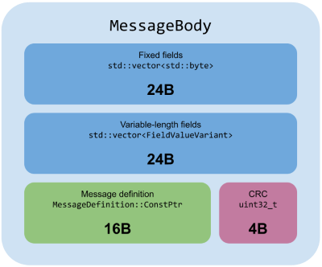
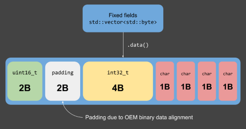
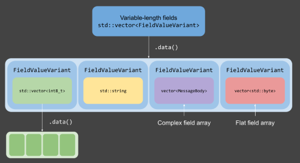

# MessageBody data structure

## Overview

A `MessageBody` stores the decoded contents of a message. It holds:
- A **fixed-size region** for fields with known byte size
- A **variable-size region** for fields whose size can vary, e.g. strings and field arrays
- A pointer to the message's **definition** and the **CRC** used for decoding

## Field storage model

### Fixed region: `std::vector<std::byte>`

- Stores all primitive fields and fixed-length arrays
- Layout matches the binary message format, including alignment constraints
- Fields that are separated by variable-length data in the message definition are "squashed" together in the fixed region

### Variable region: `std::vector<FieldValueVariant>`

- Stores vectors of primitive types, strings, and field arrays

#### Field arrays

- Stored as `std::vector<std::byte>` if every field has fixed size
- Stored as `std::vector<MessageBody>` otherwise

### Reading fields

- `MessageBody::GetFieldValue` can be used to get the value of most fields by either their definition or their name
- `MessageBody::GetValueFromFlatFieldArray` can be used to get the value of a field within the `std::vector<std::byte>` of a flat field array

### Writing fields

- `MessageBody::SetFieldValue` can be used to set the value of most fields by their definition
- `MessageBody::SetArrayElement` can be used to set the values of individual elements of FIXED_LENGTH_ARRAYs/VARIABLE_LENGTH_ARRAYs
- Use `MessageBody::GetFixedFields`/`MessageBody::GetVarFields` to obtain references to the fixed/variable regions, respectively

### Fixed field copy optimization

- If a message has no variable-length fields, then its binary form is decoded/encoded with a single `std::memcpy` to/from the fixed region
- FIXED_LENGTH_ARRAYs, VARIABLE_LENGTH_ARRAYs, and flat FIELD_ARRAYs are also copied using a single `std::memcpy`