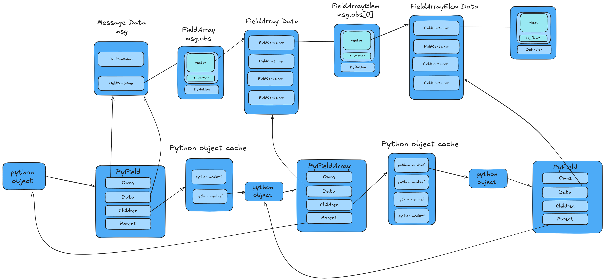

# Message Data Structure

> **Note:** This document covers internal implementation details, not library usage.

The following is a high-level overview of the internal data structure used to represent decoded messages and their fields in the Python bindings.

## Architecture Overview

In C++, the message is the sole owner of all field data. In Python, users expect each field to have its own lifetime—for example, storing `msg.obs[0]` in a variable that outlives the message. This data model reconciles these semantics without copying data: Python objects hold references back to the owning message, keeping it alive as long as any field is in use.

A caching layer ensures that accessing the same field twice returns the same Python object (as long as a reference to it exists).

## Core Components

### Data Layer (C++)

- **Message Data** — The top-level container holding a vector of `FieldContainer` objects representing each field in the decoded message.

- **FieldArray Data** — For array fields (e.g., `msg.obs`), stores a vector of `FieldContainer` objects representing each element.

- **FieldArrayElem Data** — Each array element contains its own vector of `FieldContainer` objects for the element's subfields.

- **FieldContainer** — The fundamental data unit containing:
  - A pointer to the field definition
  - The decoded field value (primitive, string, enum, or nested vector for arrays/structs)

### Python Object Layer

- **PyField** — Wraps message data or struct field data. Contains:
  - `Owns` — Whether this object owns its data (true for messages, false for array elements)
  - `Data` — Pointer to the underlying `FieldContainer` vector
  - `Children` — Cache of weak references to child `PyFieldArray` objects
  - `Parent` — Strong reference to parent object (for non-owning fields)

- **PyFieldArray** — Wraps array field data. Contains:
  - `Owns` — Always false (parent PyField owns the data)
  - `Data` — Pointer to the underlying array vector
  - `Children` — Cache of weak references to child `PyField` elements
  - `Parent` — Strong reference to parent PyField

### Python Object Cache

Each `PyFieldArray` maintains a cache of weak references to previously-accessed element `PyField` objects. When accessing an array element:

1. Check cache for existing weak reference
2. If valid, return the existing Python object
3. If invalid or missing, create a new `PyField` and cache a weak reference to it

This ensures repeated access to the same element returns the same Python object (identity preservation) while allowing garbage collection when no Python references remain.

## Ownership Model

- **Message-level PyField** objects own their data (`Owns = true`)
- **Array element PyField** objects typically do not own data (`Owns = false`) and hold a strong reference to their parent
- **PyFieldArray** objects typically do not own data and hold a strong reference to their parent PyField

However, a `PyFieldArray` or an element within one may become separated from its original message (e.g., the message attribute is re-assigned) or may be created in isolation. In these cases, the object will own its data (`Owns = true`) and no parent reference is needed.

This creates a reference chain that keeps data alive as long as any Python object referencing it exists, while allowing the garbage collector to reclaim objects when they're no longer needed.

## Field Access

Field access uses a precomputed name-to-index map stored in the database:

1. Look up field name in `FieldNameMap` to get index and type information
2. Access the `FieldContainer` at that index
3. Convert to appropriate Python type (primitive, enum, PyField for structs, PyFieldArray for field-arrays)

Field-arrays automatically expose a `<name>_length` pseudo-field returning the array size.
