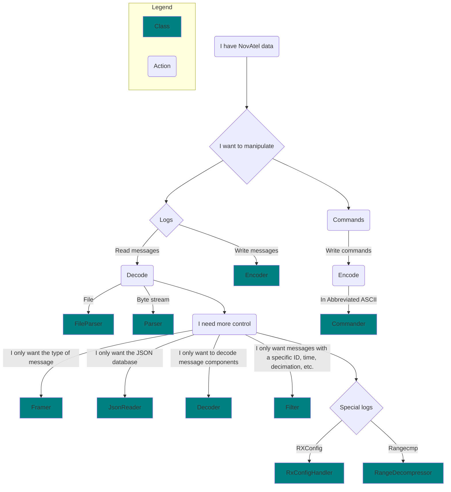

# novatel_edie

`novatel_edie` is a Python package for interfacing with EDIE. EDIE (Encode Decode Interface Engine) is a C++ SDK that can
encode and decode messages from NovAtel's OEM7 receivers from one format into another.
This package uses the nanobind binding library to expose functionality of EDIE through a Python interface.

1. [Overview](#overview)
   - [Package Structure](#package-structure)
   - [Core Functionality Breakdown](#core-functionality-breakdown)
2. [High-Level Parsing](#high-level-parsing)
   - [Basics](#basics)
   - [Direct Conversion](#direct-conversion)
   - [One-by-one Parsing](#one-by-one-parsing)
   - [Filtering](#filtering)
3. [Low-Level Parsing](#low-level-parsing)
4. [Command Encoding](#command-encoding)
5. [Data Types](#data-types)
   - [Message](#message)
   - [Response](#response)
   - [Header](#header)
   - [UnknownMessage](#unknownmessage)
   - [UnknownBytes](#unknownbytes)
   - [MessageData](#messagedata)
5. [Memory Management](#memory-management)
6. [Message Databases](#message-databases)
7. [Logging](#logging)
8. [Additional Documentation](#additional-documentation)

## Overview

### Package Structure

Functionality in `novatel_edie` is split up into three pieces:
- `novatel_edie`: All core classes and functions. 
- `novatel_edie.messages`: The default set of messages.
- `novatel_edie.enums`: The default set of enums which appear in messages.

All code in this readme assumes that the following import statement appears at the top of the file:
```python
import novatel_edie as ne
import novatel_edie.messages as ne_msgs
import novatel_edie.enums as ne_enums
```

### Core Functionality Breakdown

`novatel_edie` provides different classes for interfacing with messages at different levels of the decoder stack.



If you aren't sure where to start, checkout the following section on [High Level Parsing](#high-level-parsing).

## High-Level Parsing

### Basics

`novatel_edie` provides two classes for parsing collections of messages,
a `Parser` for parsing generic bytes data and a `FileParser` for parsing data stored within a file.
The two classes share a largely common interface, with the main difference
being how data is fed into each one.

Data is written to a `Parser` as `bytes` via its `write()` method:

```python
parser = ne.Parser()
parser.write(b'message_data')
```

A `FileParser` accesses its data from a filepath provided at instantiation:

```python
file_parser = ne.FileParser('path/to/log/file')
```

The simplest way to get information out of either object is by iterating through it.
```python
for msg in parser:
    ...
```

You can expect anything returned during iteration to be a `Message`, `Response`, `UnknownMessage`, or `UnknownBytes` object.
```python
# Iterate through all messages in a parser
for msg in parser:
    if isinstance(msg, ne.UnknownBytes):
        print(f"This set of bytes could not be identified as a message: {msg}")
    elif isinstance(msg, ne.UnknownMessage):
        print(f"No definition was found for message with id: {msg.header.id}")
    elif isinstance(msg, ne.Message):
        if isinstance(msg, ne_msgs.BESTPOS):    # use this instead of 'msg.name==...' for better type-hints
            print(f"Estimated position: (lat={msg.latitude}, long={msg.longitude})")
        else:
            print(f"Message with type: {msg.name}")
    elif isinstance(msg, ne.Response):
        print(f"Response with the following message: {msg.response_string}")
```

For more details on each of these types read the section on [Data Types](#data-types). 
Keep in mind that you only need to handle the types you care about!
For example, if you aren't concerned with `UnknownMessages` you can omit
a case for dealing with them.

Look to [converter_parser.py](./examples/converter_parser.py) and [converter_fileparser.py](./examples/converter_fileparser.py) 
for examples.

### Direct Conversion

If you just want to directly convert from one data format to another the simplest way is to use the `iter_convert` method.
This method returns an iterator which offers `MessageData` objects whose data reflect messages encoded into a specified format:

```python
for ascii_msg in parser.iter_convert(ENCODE_FORMAT.ASCII):
    print(ascii_msg)
```

Unknown data will be skipped over when using this method.

### One-by-one parsing

In some cases it makes more sense to read one message at a time. 
This can be done by calling the `read` method of either parser.
```python
msg = parser.read()
```
As with direct iteration, the `read()` method can be expected to 
return a `Message`, `Response`, `UnknownMessage`, or `UnknownBytes` object.
A difference is that the `read()` method may also raise an exception,
whereas iteration will generally skip over any data whose parsing raises an error.
In particular the `read()` method will raise an exception to indicate when 
there is not enough available data to go ahead.
For a `Parser` this will be `BufferEmptyException` exception and for 
a `FileParser` it will be  `StreamEmptyException`.

```python
while True:
    try:
        msg = parser.read()
    except ne.DecompressionFailureException:
        logging.error('A compressed RANGE log could not be decompressed')
    except ne.BufferEmpty:
        if data := get_data():
            parser.write(data)
        else break
```

Note: When using a `Parser` to process a byte-stream with abbreviated ascii content
an additional step must be taken at the end of processing: Call `read` with `decode_incomplete_abbreviated` set to `True`.
This is to ensure that the last message within the byte-stream is processed.
Abbreviated ascii is the only format which lacks an ending delimiter so it is the only 
one for which this is necessary.
```python
for msg in parser:
    ...
try:
    last_msg = parser.read(decode_incomplete_abbreviated = True)
except Exception:
    pass
```

### Filtering

Which messages are parsed can be manipulated by attaching a `Filter` to either parser.

```python
bestpos_filter = ne.Filter()
bestpos_filter.add_message_name('BESTPOS')      # Filter BESTPOS messages
bestpos_filter.message_names_excluded = False    # Set filter to be inclusive
parser = ne.Parser()
parser.filter = bestpos_filter
for bestpos_msg in parser:
    if isinstance(msg, ne_msgs.BESTPOS):    # still worth doing to enable type-hinting in IDE
        ...
```

Using a filter can make parsing go much faster as it allows expensive decoding steps 
to be skipped for filtered messages.

## Low-Level Parsing

Look to the [convert_components.py](./examples/converter_components.py) example file for 
a demonstration of how to achieve more fined grain control over parsing.

## Command Encoding

Look to the [command_encoding.py](./examples/command_encoding.py) example file for 
a demonstration of how to encode abbreviated ascii commands into other formats.

## Data Types

There are six main data types which `novatel_edie` makes use of:
- [Message](#message): A message in the sense described [here](https://docs.novatel.com/OEM7/Content/Messages/Messages.htm?tocpath=Commands%20%2526%20Logs%7CMessages%7C_____0).
- [Response](#response): A response in the sense described [here](https://docs.novatel.com/OEM7/Content/Responses/OEM7_FW_Reponses.htm?tocpath=Commands%20%2526%20Logs%7C_____4).
- [Header](#header): A header for a message which provides general information and describes the message's payload.
- [UnknownMessage](#unknownmessage): A message whose header was decoded but whose payload was unable to be decoded to its definition being unknown.
- [UnknownBytes](#unknownbytes): A sequence of raw bytes which cannot be interpreted as a message or response.
- [MessageData](#messagedata): A container for bytes reflecting a message in a particular format. 

### Message
[Messages](https://docs.novatel.com/OEM7/Content/Messages/Messages.htm?tocpath=Commands%20%2526%20Logs%7CMessages%7C_____0) are the most prominent form of data provided and accepted by a reciever. 
In `novatel_edie` they are represented by the `Message` type.

All `Message`s include a `Header` containing all information from the message's header, 
along with a number of attributes specific to the `Message`s subtype which come from its payload.

An example `Message` with a `BESTPOS` subtype:
```tree
bestpos_message
├── name
├── header
│   ├── message_id
│   └── ...
├── solution_status
├── position_type
├── latitude
├── longitude
└── ...
```

An essential feature of `Message`s is that they can be encoded into any supported format:
```python
for msg in parser:
    if isinstance(msg, Message):
        ascii_msg = msg.to_ascii()
        encode_format_msg = msg.encode(encode_format)
```

Messages can also be transformed into other representations, such as a dictionary via the `to_dict()` method.

If you wish to handle a specific message, it is highly recommended that you identify it by using `isinstance` to check its type:

```
# RIGHT 
def handle_message(msg: Message):
    if isinstance(msg, BESTPOS):
        ...

# WRONG
def handle_message(msg: Message):
    if msg.name == "BESTPOS":
        ...
```

This is because explictly identifying the type will provide additional information to your IDE,
allowing more powerful autocomplete and accurate syntax highlighting.

### Response

[Responses](https://docs.novatel.com/OEM7/Content/Responses/OEM7_FW_Reponses.htm?tocpath=Commands%20%2526%20Logs%7C_____4) are similar to messages but specifically reflect information outputted by a receiver in response to an event.

All `Response` objects have the same structure:
```tree
response
├── name
├── header
├── response_id
├── response_str
└── response_enum
```

`Responses` may be encoded into any supported format, the same as messages:
```python
for resp in parser:
    if isinstance(resp, Response):
        ascii_resp = resp.to_ascii()
        encode_format_resp = resp.encode(encode_format)
```

Likewise they can be converted to a dictionary representation via `to_dict()`.

### Header

A message contains data about the message and its payload such as the time it was created and its type.
`Header` objects have structure that mirrors the [binary header specification](https://docs.novatel.com/OEM7/Content/Messages/Binary.htm?tocpath=Commands%20%2526%20Logs%7CMessages%7C_____3).

```tree
header
├── message_id
├── message_type
│   ├── is_response
│   ├── source
│   └── format
├── port_address
└── ...
```

`Header`s can be converted to a dictionary representation via `to_dict()`.

### UnknownMessage

An `UnknownMessage` is created when the `Header` for a message is determined successfully,
but the decoder cannot access a definition for the message.
Every `UnknownMessage` contains a `Header` and a payload of un-decoded bytes.

```tree
unknown_message
├── header
│   ├── message_id
│   ├── message_type
│   └── ...
└── payload
```

Like a `Message` and `UnknownMessage` can be converted to a dictionary with `to_dict()`
however it cannot be re-encoded as its decoding is incomplete.

### UnknownBytes

`UnknownBytes` are created when the parser determines that a sequence of bytes is undecodable. The type is merely a container for raw byte data.

```tree
unknown_bytes
└── data
```

### MessageData

A `MessageData` object is a container for for the raw bytes of a message/response in a particular format.
It provides the advantage of being able to select either the header or payload of the message independently.

```tree
message_data
├── message
├── header
└── payload
```

```
>> message_data = message.to_ascii()
>> print(message_data.message)
b'#BESTPOSA,USB1,0,58.5,FINESTEERING,2209,502061.000,02000020,cdba,16809;SOL_COMPUTED,PPP,51.15043706870,-114.03067882331,1097.3462,-17.0001,WGS84,0.0154,0.0139,0.0288,"TSTR",11.000,0.000,43,39,39,38,00,00,7f,37*52483ac5\r\n'
>> print(message_data.header)
b'#BESTPOSA,USB1,0,58.5,FINESTEERING,2209,502061.000,02000020,cdba,16809;'
>> print(message_data.payload)
b'SOL_COMPUTED,PPP,51.15043706870,-114.03067882331,1097.3462,-17.0001,WGS84,0.0154,0.0139,0.0288,"TSTR",11.000,0.000,43,39,39,38,00,00,7f,37*52483ac5\r\n'
```

## Memory Management

It is important to recognize that the  [custom data types](#data-types) used by `novatel_edie` 
use significantly more memory than the raw byte representations they are derived from.
For example, a `Message` object created by parsing a binary message will require ~30x 
more memory to store than the original format.
There is plans to optimize the memory usage in future releases but much of 
it is fundamental to the act of deconstructing highly compact message formats
into usable objects.

With this in mind it is recommended that users do not try to store a large number
of `Message`/`Response` objects in memory.

The following are a few strategies to avoid this:

1. **Calculate metrics of interest during parsing**: When it is possible, this approach avoids the issue of storing data all together.
2. **Convert messages to a more efficient data format**: Storing the values of messages in a simpler format such as a list of lists can cut down on per message memory usage. This will still run into memory limitations for large enough data sets.
3. **Send messages to a database**: Storing messages in a database once again avoids the problem of memory usage entirely. The `to_dict()` is helpful here as many databases have python libraries which support uploading data in dictionary format.
4. **Process in batches of fixed size**: Alternating between parsing and processing can allow for reasonable memory usage, while keeping code modular. This method can still run into memory usage issues if the batch size is too large.

## Message Databases

In order to decode or encode a message `novatel_edie` requires a database 
with that message's definition.

For convenience `novatel_edie` comes with a built-in message database
(stored within the `messages.json` file), 
whose messages and enum values can be accessed via the 
`novatel_edie.messages` and `novatel_edie.enums` submodules respectively.

```python
from novatel_edie.messages import BESTPOS
from novatel_edie.enums import SolStatus
```


If this builtin message database is inconsistent with message data you want to 
parse, you can install a different database from a `.json` file by 
providing it as an argument to the novatel edie command line tool:

```
novatel_edie install-custom <path-to-your-json-database-file>
```

In cases where multiple or fully dynamic databases are required, 
`MessageDatabase` objects can be constructed specified as the source 
for decoding/encoding processes.

```python
# Load a fully dynamic database
custom_db = MessageDatabase('path/to/my/database')

# Access values of the database
bestpos_type = custom_db.get_message_type('BESTPOS')
sol_status_enum = db.get_enum_type_by_name('SolStatus')

# Parse based on different databases
default_db_parser = Parser()
custom_db_parser = Parser(message_db=custom_db)
```

The built-in message database can also be dynamically accessed in the same way:

```python
builtin_db = get_builtin_database()
bestpos_type = builtin_db.get_message_type('BESTPOS')
```

In general it is recommend to use the default or custom installed database
whenever possible to take advantage of additional static type information (e.g. autocomplete).

## Logging

`novatel_edie` preforms all its logging via the python standard library `logging` module 
which can be configured for `novatel_edie` the same as for any other package.

The one thing to keep in mind is that the level of a logger **must only** be set via the 
`setLevel()` method rather than directly, as is directed in the official [logging documentation](https://docs.python.org/3/library/logging.html#:~:text=Do%20not%20set%20this%20attribute%20directly).
Failing to follow this rule will result in undefined behavior.

## Additional Documentation

The best reference point for up-to-date information on specific classes, functions, and return types 
is in the python interface files included with the package distribution.

```tree
novatel_edie
├── bindings.pyi (main definitions)
├── messages.pyi (message definitions)
├── enums.pyi (enum definitions)
└── ...
```
