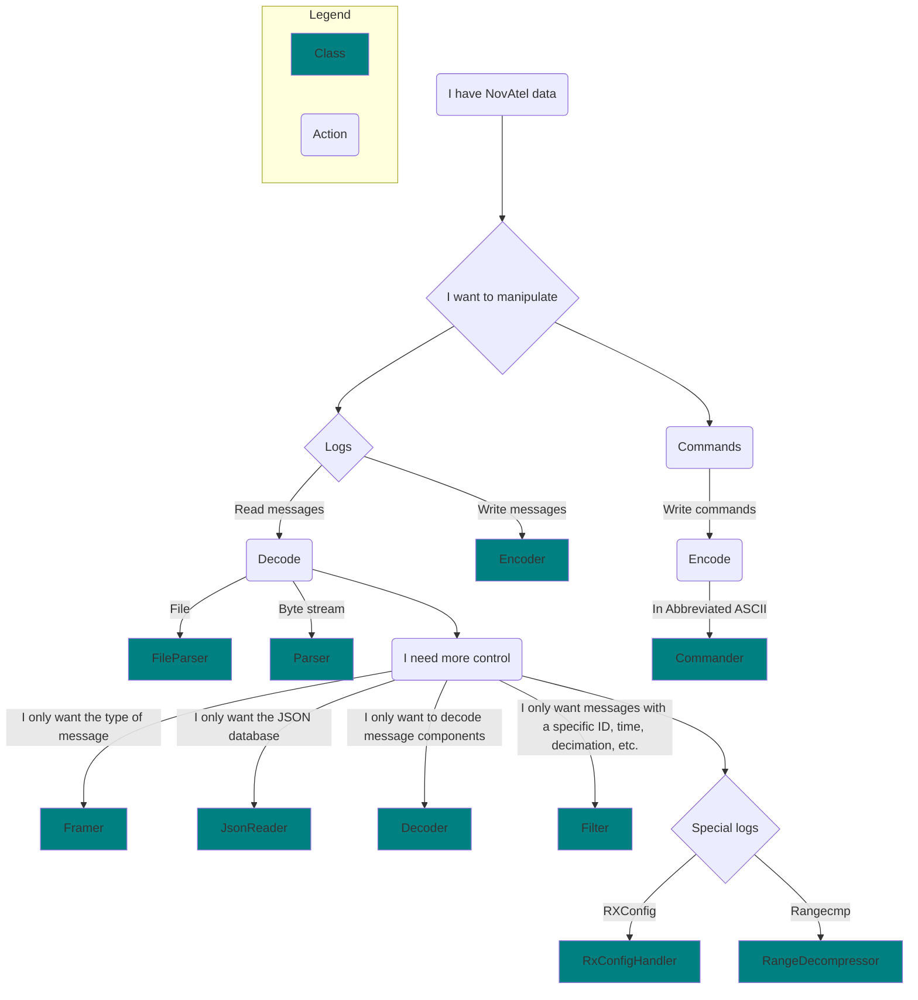

# novatel_edie

`novatel_edie` is a Python package for interfacing with EDIE. EDIE (Encode Decode Interface Engine) is a C++ SDK that can
encode and decode messages from NovAtel's OEM7 receivers from one format into another.
This package uses the nanobind binding library to expose functionality of EDIE through a Python interface.

## Usage

`novatel_edie` provides different classes for interfacing with messages at different levels of the decoder stack. More 
details are provided in the EDIE C++ repository but are summarized in the flowchart below.



## Message Databases

In order to decode or encode a message `novatel_edie` requires a database 
with that message's definition.

For convience `novatel_edie` comes with a built-in message database
(stored within the `messages.json` file), 
whose messages and enum values can be accessed via the 
`novatel_edie.messages` and `novatel_edie.enums` submodules respectively.

```python
from novatel_edie.messages import BESTPOS
from novatel_edie.enums import SolStatus
```


If the default message database is inconsistent with message data you want to 
parse, you can install a different database from a `.json` file by 
providing it as an argument to the novatel edie command line tool:

```
novatel_edie install-custom <path-to-your-json-database-file>
```

In cases where multiple or fully dynamic databases are required, 
`MessageDatabase` objects can be constructed specified as the source 
for decoding/encoding processes.

```python
# Load a fully dynamic database
custom_db = MessageDatabase('path/to/my/database')

# Access values of the database
bestpos_type = custom_db.get_message_type('BESTPOS')
sol_status_enum = db.get_enum_type_by_name('SolStatus')

# Parse based on different databases
default_db_parser = Parser()
custom_db_parser = Parser(message_db=custom_db)

```

In general it is recommend to use the default or custom installed database
whenever possible to take advantage of additional static type information (e.g. autocomplete).

## High Level Parsing

`novatel_edie` provides two classes for parsing message collections,
a `FileParser` for parsing data stored within a file, 
and a `Parser` for parsing generic bytes data.
The two classes share a largely common interface, with the main differences
being how data is fed into each one.

Data is written to a `Parser` as `bytes` via its `write()` method:

```python
parser = Parser()
parser.write(b'message_data')
```

A `FileParser` receives its data upon instantiation:

```python
file_parser = FileParser('path/to/log/file')
```

The simplest way to get information out of either object is by iterating through it. 
It is recommended to handle different values is by checking their type. 
You can expect anything returned via iterating through a parser to either 
be a `Message` or `bytes` object.
```python
# Iterate through all messages in a parser
for msg in parser:
    if isinstance(msg, bytes):
        pass
    elif isinstance(msg, IncompleteMessage):
        print(msg.header)
    elif isinstance(msg, BESTPOS):
        print(msg.latitude)
```
Under certain circumstances parsing may encounter an error,
if you wish to handle this it is recommended to iterate through 
the `FileParser`/`Parser` object manually via the `read()` method.
```python
while True:
    try:
        msg = parser.read()
    except DecompressionFailureException:
        logging.error('A compressed RANGE log could not be decompressed')
    except StopIteration:
        if data := get_data():
            parser.write(data)
        else break
```
It is also necessary to call the `read()` method at the end of 
processing a byte-stream with a `Parser` with the `decode_incomplete_abbreviated`
set to `True`. 
This is to ensure that if the last message within the byte-stream was abbreviated ascii (which lacks any end-of-message signifier) will be processed.
```python
for msg in parser:
    ...
try:
    last_msg = parser.read(decode_incomplete_abbreviated = True)
except Exception:
    pass

```

Direct format conversion is also supported via the `convert` method:
```python
for ascii_msg in parser.convert(ENCODE_FORMAT.ASCII):
    print(ascii_msg)
```
Note that any messages which cannot be fully decoded will simply be ignored under this method.

## Message Objects

`novatel_edie` decodes message byte data into more useable `Message` objects.
`Message`s come in two forms `CompleteMessage` objects which contain a `Header` object along with attributes for each field of the particular message, and `IncompleteMessages` which only contain a `Header` and raw bytes. `IncompleteMessages` are generally produced when attempting to decode a message without having the definition for it.

An example `CompleteMessage` for the `BESTPOS` log:
```
BESTPOS
    ├── header
    │   ├── message_id
    │   ├── message_type
    │   └── ...
    ├── solution_status
    ├── position_type
    ├── latitude
    ├── longitude
    └── ...
```

An  `IncompleteMessage`
```
BESTPOS
    ├── header
    │   ├── message_id
    │   ├── message_type
    │   └── ...
    └── bytes
```

All messages can be converted to dictionaries via their `to_dict()` method:
```python
for msg in parser:
    if isinstance(msg, Message):
        msg_dict = msg.to_dict()
```

Only complete messages can be encoded back into another format:
```python
encoder = Encoder()
for msg in parser:
    if isinstance(msg, CompleteMessage):
        ascii_msg = msg.to_ascii()
        ascii_msg = encoder.encoder(msg, ENCODE_FORMAT.ASCII)
```

Supported encoding formats are binary, flattened binary, ascii, abbreviated ascii, and json.
